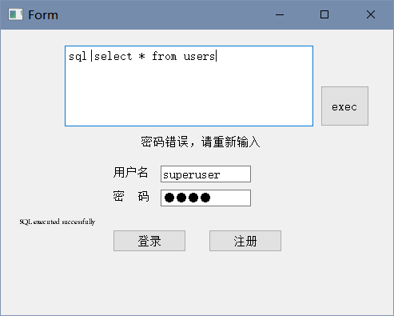
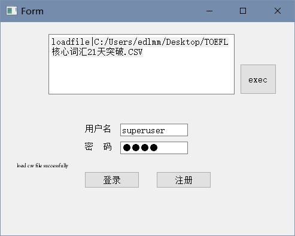

# Word Battle 单词消除游戏系统

## **项目介绍**

**单词消除游戏总体介绍：** 

单词消除游戏由两类参与者组成，闯关者（即游戏玩家），出题者（为游戏增加游戏中使用单词）。游戏规则为，游戏每一轮，程序会根据该关卡难度，显示一个单词，一定时间后单词消失。闯关者需要在相应地方输入刚刚显示并消失的单词，如果闯关者输入正确（即闯关者输入的单词与刚刚显示的单词完全一致，包含大小写）则为通过。一关可以由一轮或者多轮组成。

### 阶段一

闯关者属性要求必须含有：闯关者姓名、已闯关关卡数、闯关者经验值、闯关者等级，若有需要可以自行添加其他属性。出题者属性要求必须含有：出题者姓名、出题者出题数目，等级，若有需要可以自行添加其余属性。

**具体功能**包括：

- 实现闯关者，出题者本地的注册，登录。
- 程序支持多人注册，同一时间只有一人可以登录。
- 任何角色均可查询所有闯关者，出题者，按照属性查找相应闯关者，出题者。
- 可以根据闯关者闯过关卡数，经验，等级等对闯关者排名，根据出题者出题数目，等级对出题者排名。

**要求**：

- 采用面向对象的方式，使用类设计。
- 在设计类时请注意类的继承关系，关注闯关者，出题者的关联（闯关者与出题者有共同的基类）。
- 使用文件或者数据库作为存储对象，自行设计设计文件格式，或者数据库表结构。
- 在题目的要求下自行扩展功能，功能扩展适当者酌情加分。

### 阶段二

闯关者即为游戏玩家，已经注册并登录的玩家可以在系统进行单词消除游戏。每一关的难度要有所增加，体现为如下三个条件中的一个或者多个：1、单词难度可以递增或者持平（即长度加长或不变）； 2、进行轮数增多（即单词数目如：前三关仅仅通过一个单词就过关，后续需要通过两个，三个甚至更多才过关）； 3、单词显示时间缩短（随着关卡的增加显示时间越来越短）。

闯关者每闯过一关，增加一定经验值。经验值会根据闯过的该关卡的关卡号、该关的闯关耗费时间共同决定。当经验值累计到一定程度闯关者等级增加。闯关失败需要**重新**闯该关。

游戏自带词库，而且已经注册的出题者可以为系统出题，即增加词库的新词，已经存在的单词不能再次添加（词库中的单词构成一个单词池，但建议根据单词的长度来组织存储，每次出题时，系**统从该单词池中按照关卡难度随机的选择相应长度的单词**）。每成功出题一次，更新该出题者的出题数目。出题者等级根据出题人成功出题数目来升级。

- 必须在题目一的基础上进行修改。
- 请根据要求设计每一关的出题方式，注意随着关卡数增加，题目难度增加。请合理处理出题人新添加新词的使用方式，并且新加词组不会影响游戏难度。
- 设计闯关者经验值，等级增加策略。出题者等级升级策略。

### 阶段三

在题目二的基础上，将游戏由本地单机，扩展为服务器多人游戏平台，使用客户端/服务器的方式。将所有闯关者，出题者信息保存在服务器。

- 除单人游戏外，增加双人对战游戏，要求参与闯关者均已经登录，双人同时面对一个单词，最先打出正确单词者获得经验增长，在双人对战中获胜所获得的经验增长要**高于**从同等难度的单人游戏中所获得的经验增长，失败者则需要扣除一定经验值。
- 可以查看同时在线的游戏闯关者，可以挑战在线的游戏玩家，被挑战者接受挑战后进入双人对战。
  要求：
  - 必须在题目二基础上进行修改
  - 使用socket进行通信技术
  - 需要完成服务器端程序，以及客户端程序，客户端可以启动多个同时与服务器交互，要求训练服务器并发处理能力。
  - 可以自行扩展功能，扩展功能适当者加分。


## 项目设计

本项目开发分为三个阶段，串行实现，每一个阶段的项目都基于前一个项目，故在git中会分别用三个 Branch 保存。

基于 C++/Qt 开发，总体设计基于C/S模型，在设计将实现划分为服务端和客户端，便于开发和维护。程序的主要模块包括：

- 游戏界面交互-C端
- 用户数据维护-S端

部分游戏设计思路参考 Qt Documentation 中的 [Tetrix Example](https://doc.qt.io/qt-5/qtwidgets-widgets-tetrix-example.html)。


### 游戏界面交互模块

**程序功能划分：**

| 功能名称       | 开发阶段 | 备注         |
| -------------- | -------- | ------------ |
| 界面控制       | 1        |              |
| 注册/登录界面  | 1        |              |
| 出题界面和逻辑 | 2        |              |
| 闯关界面和逻辑 | 2        |              |
| 排行榜界面     | 1        |              |
| 查询界面       | 1        |              |
| 超级用户界面   | 2        | 附在登录界面 |


游戏的**注册/登录界面**应该是最先显示出来的界面。对应的 `AccountWindow` 类应该包含以下功能：

- 与用户数据模块交互，判断用户名是否存在。
- 读取用户输入信息，并转换为用户数据存储格式。
- 与 `UserControl` 交互，更新游戏程序的当前使用用户。
- 根据某种依据，保存用户密码的时候应先在本地做**数据加密计算**。（额外）
- 提供超级用户界面，具体操作在**『其他』**章节。

**排行榜界面**对应 `RankWindow` 类：

- 对给定的用户信息进行显示，根据用户类型和输入的用户数量决定显示的位置。
- 读取数据库信息，将用户转为上面显示方法需要的特定格式。同时除去默认方式外，允许指定某种属性进行排序，调整升序降序等。add
- 按用户名或其他属性查询用户并显示。

> This example shows how a simple game can be created using only three classes:
>
> - The `TetrixWindow` class is used to display the player's score, number of lives, and information about the next piece to appear.
> - The `TetrixBoard` class contains the game logic, handles keyboard input, and displays the pieces on the playing area.
> - The `TetrixPiece` class contains information about each piece.

仿照这里的设计思路，我的**闯关/出题界面**部分也分为类似的 Classes：

- `VocabularyBoard` 作为出题界面：
  - 游戏计时器
  - 用户相关信息的显示，规定格式与区域
  - 当前出题者信息
  - 提供面向用户的单词输入文本框
  - 判断当前**单词是否合法**（额外）
  - 当前单词的显隐控制
  - 界面跳转按钮
- `ChallengeBoard` 出题界面：
  - 游戏计时器
  - 用户相关信息的显示，规定格式与区域
  - 将当前闯关者的信息转换为基类显示需要的格式后显示
  - 游戏逻辑部分。
    - 根据关卡计算单词消失时间
    - 判断是否闯关失败（3次机会）
  - 当前单词的显隐控制
  - 提供面向用户的单词输入文本框
  - 界面跳转按钮
  - 当前关卡信息，当前词库信息显示
  - 词汇显示
  - **在线对战模式延长倒计时，时间到以后任意一方可以跳过该单词**

### 用户数据维护模块

程序功能划分：

| 功能名称                   | 开发阶段 | 备注 |
| -------------------------- | -------- | ---- |
| 请求更新用户数据信息       | 1        | C端  |
| 请求用户数据               | 1        | C端  |
| 两种用户经验等级计算逻辑   | 2        | C端  |
| 闯关者根据关卡进行词库选择 | 2        | C端  |

 `UserControl` 类来控制

- **当前**用户信息的临时存储，以及更新保存。

`ClientAccess` 类在**C端**负责所有C端与S端的通讯。

- 更新用户信息
- 增加用户
- 登录匹配
- **注销并且保存用户信息到数据库（唯一途径）**
- 查询排行榜用户
- 查询匹配用户
- 批量导入自带词库
- 在数据库中增加单词，允许和自带词库重叠，如果重叠，将数据库出题人更新为用户。
- 判断当前**单词是否合法**（额外）。
- 单词数据库包含**单词，单词长度，出题者用户名，出题日期**
- 查询单词（额外？）

`UserInfo` 类是存储用户信息的基类，包含：

- **用户名，关卡/数量，等级，经验值，游戏时间（min）属性**
- 计算经验值阈值升级的方法 `expToNext`。
- `stageup` 用户等级提升一级。

派生`uChallenger` 类继承`UserInfo` 类

- `addExp` 根据传入的**单词，是否在线对战，当前关卡和等级**计算对应经验值信息，更新用户等级和经验值状态。

  `新增经验=单词长度* （累积出题量*0.5+ 当前等级 + 累积游戏时间*0.01）*5+ 0.05* expToNext`

- `nStageWord` 计算各个关卡需要完成的单词数量

- `WordShowTime` 计算当前单词显示的秒数

- `wordLength` 计算当前关卡出题所需**最短单词长度**，该下限的上限为7
  `len=3+关卡*0.2`

派生`uVocabulor` 类继承`UserInfo` 类

- `addExp` 根据传入的**单词和当前等级**计算对应经验值信息，更新用户等级和经验值状态。
  `新增经验=单词长度* （累积出题量*0.01+ 当前等级  + 累积游戏时间*0.01）*10`
- `addOneWord` 每次新增单词的时候更新内存中用户的出题数量并传入单词给 `addExp` 。

### C/S模型

该模型完全服务于在线对战功能的实现，S端环境为 Debian 9 的 Linux 系统，配置了 MySQL 的 client 和 server 环境。服务器端通过 socket 监听用户信息，完成任务。

游戏规则：

1. 用户可以对在线用户列表中的用户发起挑战。
2. 挑战接收后开始对战。
3. 服务器给双方发送单词，倒数5秒后单词消失开始复现，不限尝试次数。
4. 复现时间短的一方得分，耗时30秒以上为过期，双方平分，游戏延长。
5. 先得5个胜局者获得最终胜利。

服务端任务划分：

1. 用户登录与下线记录。
   下线方式选哪一个？生存时间/对战请求失败/关闭窗口动作读取。
2. 对在线用户发起对战，用户接收对战信息并同意。
3. 记录实时对战的信息，并且更新对战状态。
   - 接收来自用户的单词完成状态。
   - 通知双方完成顺序的判定结果，根据本地发送过来的完成时间。
   - 随机获取单词，并且分发。
   - 通知双方当前局的游戏进度/比分，结束时删除对战。

在线对战相关的数据库表格：

1. 在线用户
   `用户名|等级|关卡|时间`
2. 对战
   `发起方|发起方得分|接受方|接受方得分|当前单词|发起方完成时间|接受方完成时间`

用户交流信息设计：

用户和服务器端交流信息设计：

`<username>|<>|`

服务器端信息设计：


## 其他

### 程序运行

阶段一的release程序使用要求比较严苛，必须要按照以下要求配置好一个本地的 *MySQL* 服务端环境。否则需要自己修改数据库登录信息后重新编译。

```bash
udb.setHostName("127.0.0.1");
udb.setPort(3306);
udb.setUserName("root");
udb.setPassword("000000");
udb.setDatabaseName("wordbattle");
```

### superuser

增加了一个超级用户入口，用于导入词库和调试。

`sql| <statement>` 执行 **MySQL语句**。



`loadfile|C:/Users/edlmm/Desktop/TOEFL核心词汇21天突破.CSV 导入词库`。注意CSV格式为单词在第一列，且没有表头等其他荣誉信息。



### 打包发布

另外，关于数据库引擎的准备和release问题，本软件采取了**MYSQL**。

数据库本地调用也遇到了问题：

- 安装对应 32bit/64bit 的 MYSQL C Connector（C++ Connector not working），并将其 `dll` 文件拷贝到相应的编译文件夹（如MinGW的bin）下。

关于打包发布：

- 在 release 模式下编译运行后可以在工程文件夹的同级目录下找到临时调试的文件夹，进入后在 `release` 中将可执行文件拷贝到另一个自定义路径 `release_folder`。

- 必须进入 Qt 提供的相应的 runtime environment 的 Prompt， 来使用Qt官方的命令 `windeployqt <release_folder` 进行Release，否则会有一些 `dll` 缺失。
- `windeployqt` 会忽略 `libmysql.dll` 和 `libmysql.lib`，导致数据库驱动导入异常，必须手动拷贝到文件夹下。
- 使用 *Enigma Virtual Box* 选择 `release_folder` 并把所有的文件添加进去，选择输出路径后打包可以得到文件夹。

### 服务器端使用MySQL

[主要参照博文来运行，](https://www.cnblogs.com/huanglianjing/p/4292958.html)以及学习[代码示例](https://www.cnblogs.com/Carsonbingo/p/10496880.html)。

编译链接命令应该包含如下信息：

`g++ run_mysql.cpp -I/usr/include/mysql -o run_mysql -lmysqlclient`